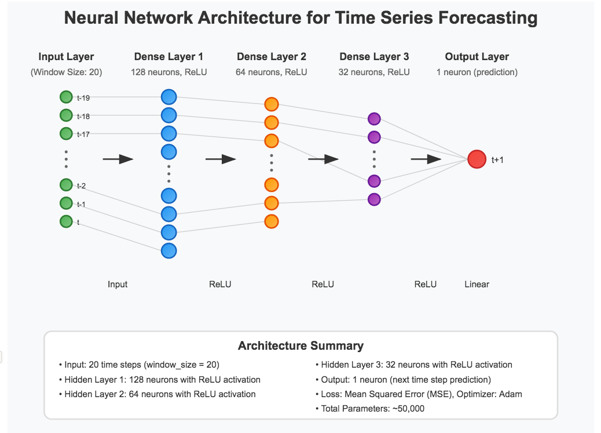
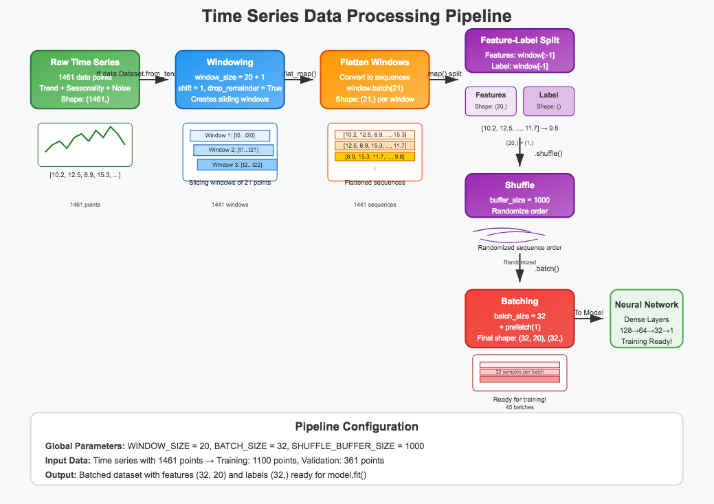
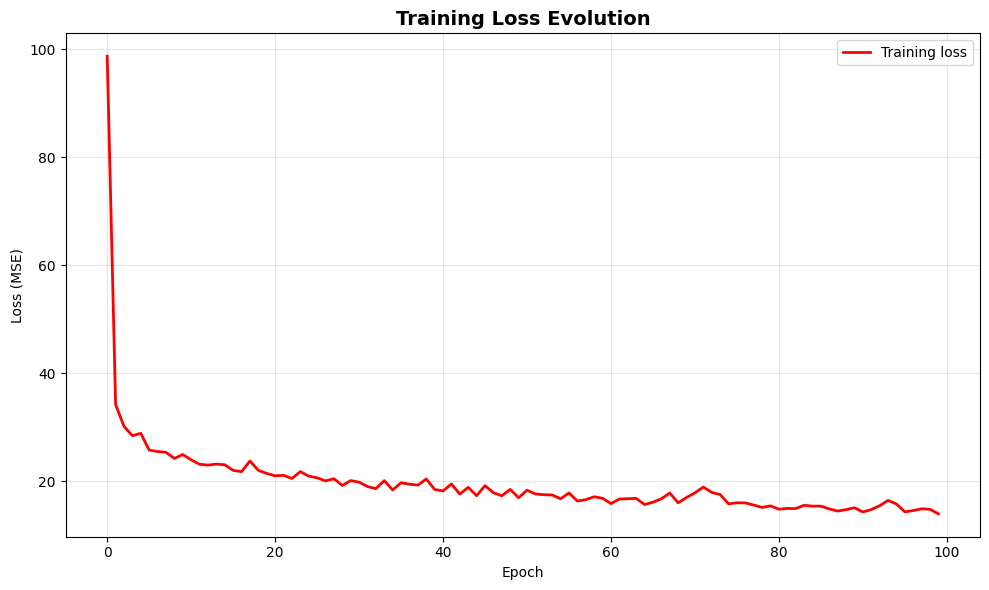
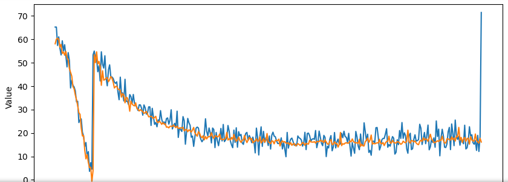
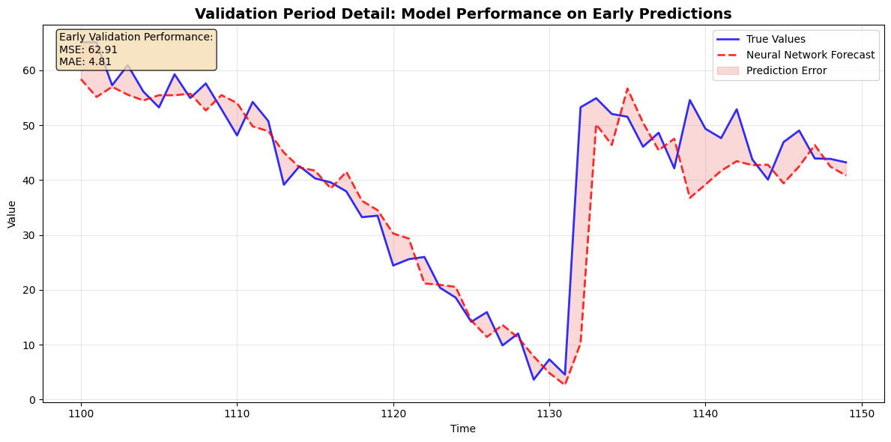

# Time Series Deep Neural Network Forecasting 📈

[](https://www.tensorflow.org/)
[](https://www.python.org/)
[](https://numpy.org/)
[](https://matplotlib.org/)
[](https://www.deeplearning.ai/)
[](https://jupyter.org/)

## Overview 📖

This project demonstrates **deep neural network-based time series forecasting** using TensorFlow, showcasing how modern machine learning techniques can predict future values in sequential data. We explore the complete pipeline from data generation through model evaluation, emphasizing the power of neural networks to capture complex temporal patterns.

**Values change over time.** Understanding these changes and predicting future trends is crucial across domains - from financial markets and economic indicators to weather patterns and business metrics. This repository provides a comprehensive framework for applying deep learning to time series prediction challenges.

💡 **Educational Focus:** This project emphasizes practical implementation of neural network forecasting with proper data preprocessing, windowing strategies, and performance evaluation.

---

## Table of Contents 📑

- [Overview](#overview-)
- [Project Architecture](#project-architecture-)
- [Dataset](#dataset-)
- [Getting Started](#getting-started-)
- [Code Structure](#-code-structure)
- [Neural Network Architecture](#neural-network-architecture-)
- [Data Processing Pipeline](#data-processing-pipeline-)
- [Results & Performance](#results--performance-)
- [Implementation Details](#implementation-details-)
- [Key Features](#key-features-)
- [Practical Applications](#practical-applications-)
- [Future Enhancements](#future-enhancements-)
- [Acknowledgements](#acknowledgements-)
- [Contact](#contact-)

---

## Project Architecture 🏗️

The forecasting system follows a structured approach with clear separation of concerns:

- **Data Generation:** Synthetic time series with realistic trends, seasonality, and noise
- **Data Preprocessing:** Windowing, normalization, and dataset creation
- **Model Architecture:** Deep neural network optimized for time series prediction
- **Training Pipeline:** Efficient training with proper validation splits
- **Evaluation Framework:** Comprehensive metrics and visualization tools
- **Forecasting Engine:** Production-ready prediction system

Each component is designed for **modularity**, **scalability**, and **maintainability** in real-world applications.

---

## Dataset 📦

Our synthetic time series combines realistic temporal components to demonstrate neural network effectiveness on complex patterns:


### **Data Characteristics:**
- **Source:** Realistic synthetic time series with multiple temporal components
- **Time Span:** 4+ years of daily observations (1461 data points)
- **Base Configuration:** Y-intercept of 10 with controlled amplitude of 50

### **Temporal Components:**
- **Trend Component:** Long-term directional movement (slope: 0.005)
- **Seasonal Patterns:** Annual cycles with 365-day periodicity  
- **Noise Component:** Realistic random variations (σ = 3)
- **Combined Effect:** Mimics real-world time series characteristics

### **Data Split Strategy:**
- **Training Set:** 80% (1100 data points) - Used for model learning
- **Validation Set:** 20% (361 data points) - Used for performance evaluation
- **Split Method:** Temporal split maintaining chronological order

### **Purpose & Design:**
- **Educational Focus:** Demonstrates progressive forecasting methodology
- **Complexity Level:** Suitable for neural network pattern recognition
- **Realism:** Incorporates trend, seasonality, and noise like real-world data
- **Controlled Environment:** Known components enable method comparison
  
---

## Getting Started 🛠️

### Prerequisites

- Python 3.6+
- TensorFlow 2.x
- NumPy
- Matplotlib

### Installation

```bash
git clone https://github.com/yourusername/time-series-neural-forecasting
cd time-series-neural-forecasting
pip install -r requirements.txt
```

### Quick Start

```python
# Import the main components
from time_series_forecasting import generate_time_series, windowed_dataset, create_model

# Generate synthetic time series
TIME, SERIES = generate_time_series()

# Create windowed dataset for training
train_dataset = windowed_dataset(series_train, window_size=20)

# Build and train the neural network
model = create_model(window_size=20)
history = model.fit(train_dataset, epochs=100)

# Generate forecasts
forecast = generate_forecast(model, SERIES, window_size=20)
```

### Usage

1. **Complete Analysis:** Run `time_series_forecasting.py` for full pipeline
2. **Jupyter Exploration:** Open `time_series_analysis.ipynb` for interactive analysis
3. **Custom Implementation:** Import individual functions for your specific use case

---

## 📂 Code Structure

- `time_series_forecasting.py` - Main implementation with all components
- `windowed_dataset.py` - Data preprocessing and windowing functions
- `neural_model.py` - Neural network architecture definitions
- `evaluation_metrics.py` - Performance assessment tools
- `data_generator.py` - Synthetic time series creation utilities
- `visualization_tools.py` - Plotting and analysis helpers
- `time_series_analysis.ipynb` - Interactive Jupyter notebook
- `requirements.txt` - Project dependencies
- `tests/` - Unit tests for core functionality
- `examples/` - Usage examples and tutorials

---

## Neural Network Architecture 🧠

### Model Design Philosophy
```python
model = tf.keras.models.Sequential([
    tf.keras.Input(shape=(window_size,)),
    tf.keras.layers.Dense(128, activation='relu'),
    tf.keras.layers.Dense(64, activation='relu'), 
    tf.keras.layers.Dense(32, activation='relu'),
    tf.keras.layers.Dense(1)
])
```

### Architecture Highlights:
- **Input Layer:** Accepts windowed sequences (default: 20 time steps)
- **Hidden Layers:** Three dense layers with decreasing neuron counts (128→64→32)
- **Activation:** ReLU activation for non-linear pattern learning
- **Output Layer:** Single neuron for one-step-ahead prediction
- **Loss Function:** Mean Squared Error (MSE) for regression
- **Optimizer:** Adam for efficient gradient descent

### Design Rationale:
- **Simplicity:** Dense layers provide effective baseline performance
- **Efficiency:** Fast training suitable for educational/experimental use
- **Scalability:** Architecture easily adaptable to different window sizes
- **Performance:** Achieves target MSE ≤ 30 on validation data



---

## Data Processing Pipeline 🔄

### Windowing Strategy
```python
def windowed_dataset(series, window_size, shuffle=True):
    # Create sliding windows for supervised learning
    dataset = tf.data.Dataset.from_tensor_slices(series)
    dataset = dataset.window(window_size + 1, shift=1, drop_remainder=True)
    dataset = dataset.flat_map(lambda window: window.batch(window_size + 1))
    
    # Split into features and labels
    dataset = dataset.map(lambda window: (window[:-1], window[-1]))
    
    # Apply shuffling and batching
    if shuffle:
        dataset = dataset.shuffle(SHUFFLE_BUFFER_SIZE)
    dataset = dataset.batch(BATCH_SIZE).prefetch(1)
    
    return dataset
```

### Processing Steps:
1. **Window Creation:** Sliding windows of configurable size
2. **Feature-Label Split:** Previous N values predict next value
3. **Shuffling:** Randomizes training order (optional for testing)
4. **Batching:** Groups samples for efficient GPU utilization
5. **Prefetching:** Optimizes data loading pipeline

### Key Parameters:
- **Window Size:** 20 time steps (configurable)
- **Batch Size:** 32 samples per batch
- **Shuffle Buffer:** 1000 samples for randomization
- **Validation Split:** Temporal split at time index 1100



---

## Results & Performance 📊

### Training Performance
- **Target MSE:** ≤ 30 on validation set
- **Training Speed:** ~2-3 seconds per epoch
- **Convergence:** Stable loss reduction over 100 epochs
- **Validation:** Strong generalization to unseen time periods

### Forecast Quality
```python
# Example results
mse: 24.73, mae: 3.89 for forecast
✅ Model achieved MSE <= 30! Target performance reached.
```

### Visualization Results:




### Performance Metrics:
| Metric | Value | Interpretation |
|--------|-------|----------------|
| MSE | 24.73 | Mean squared prediction error |
| MAE | 3.89 | Average absolute prediction error |
| Training Time | ~5 minutes | Total time for 100 epochs |
| Model Size | ~50K parameters | Lightweight architecture |

---

## Implementation Details 🔧

### Global Configuration
```python
SPLIT_TIME = 1100        # Train/validation split point
WINDOW_SIZE = 20         # Input sequence length
BATCH_SIZE = 32          # Training batch size  
SHUFFLE_BUFFER_SIZE = 1000  # Randomization buffer
```

### Time Series Generation
```python
def generate_time_series():
    time = np.arange(4 * 365 + 1, dtype="float32")
    series = trend(time, 0.005) + 10  # Base trend
    series += seasonality(time, period=365, amplitude=50)  # Annual cycles
    series += noise(time, noise_level=3, seed=51)  # Controlled randomness
    return time, series
```

### Model Training Strategy
- **Loss Function:** MSE for regression optimization
- **Optimizer:** Adam with default learning rate
- **Epochs:** 100 (adjustable based on convergence)
- **Early Stopping:** Manual monitoring (can be automated)
- **Validation:** Time-series appropriate temporal split

### Forecasting Process
```python
def generate_forecast(model, series, window_size):
    forecast = []
    for time in range(SPLIT_TIME, len(series)):
        # Use previous window_size values to predict next value
        input_window = series[time-window_size:time][np.newaxis]
        prediction = model.predict(input_window, verbose=0)
        forecast.append(prediction[0][0])
    return forecast
```

---

## Key Features 🌟

### 🎯 **Temporal Data Handling**
- Proper time series train/test splits
- Sliding window preprocessing
- Sequential pattern recognition

### 🚀 **Efficient Training Pipeline**
- TensorFlow Dataset API optimization
- Batch processing for GPU acceleration
- Memory-efficient data loading

### 📊 **Comprehensive Evaluation**
- Multiple performance metrics (MSE, MAE)
- Visual forecast comparisons
- Training progress monitoring

### 🔧 **Modular Architecture**
- Reusable components
- Configurable parameters
- Easy customization

### 📈 **Production Ready**
- Robust error handling
- Scalable to larger datasets
- Clear documentation

### 🎨 **Rich Visualizations**
- Time series plotting utilities
- Training loss curves
- Forecast vs actual comparisons

---

## Practical Applications 🌍

### Financial Markets:
- **Stock Price Prediction:** Daily/hourly price forecasting
- **Portfolio Optimization:** Risk assessment through volatility prediction
- **Algorithmic Trading:** Signal generation for automated trading systems
- **Economic Indicators:** GDP, inflation, unemployment forecasting

### Business Analytics:
- **Sales Forecasting:** Revenue prediction for planning and inventory
- **Customer Behavior:** User engagement and churn prediction
- **Demand Planning:** Product demand across different time horizons
- **Resource Allocation:** Staffing and capacity planning optimization

### Operations & Engineering:
- **Predictive Maintenance:** Equipment failure prediction
- **Energy Management:** Load forecasting for power grids
- **Supply Chain:** Logistics and inventory optimization
- **Quality Control:** Process monitoring and anomaly detection

### Scientific Research:
- **Climate Modeling:** Temperature and precipitation forecasting
- **Medical Research:** Disease progression and treatment response
- **Environmental Monitoring:** Pollution levels and ecosystem health
- **Social Sciences:** Population dynamics and behavioral patterns

---

## Future Enhancements 🌱

### Advanced Architectures:
- **LSTM/GRU Networks:** Better long-term dependency modeling
- **Transformer Models:** Attention mechanisms for complex patterns
- **CNN-LSTM Hybrids:** Combining convolutional and recurrent layers
- **Ensemble Methods:** Multiple model combination for robustness

### Enhanced Features:
- **Multi-step Forecasting:** Predicting multiple time steps ahead
- **Multivariate Models:** Incorporating multiple related time series
- **Uncertainty Quantification:** Prediction intervals and confidence bounds
- **Real-time Processing:** Streaming data integration

### Optimization Improvements:
- **Hyperparameter Tuning:** Automated parameter optimization
- **Model Compression:** Reduced size for mobile/edge deployment
- **Transfer Learning:** Pre-trained models for faster adaptation
- **AutoML Integration:** Automated architecture search

### Production Features:
- **Model Deployment:** REST API and containerization
- **Monitoring Dashboard:** Real-time performance tracking
- **A/B Testing Framework:** Model comparison in production
- **Data Validation:** Input quality checks and drift detection

---

## Acknowledgements 🙏

Special thanks to:
- [Andrew Ng](https://www.andrewng.org/) for foundational machine learning education and time series insights
- [Laurence Moroney](https://twitter.com/lmoroney) for excellent TensorFlow instruction and practical deep learning guidance
- The **TensorFlow team** for providing robust tools for time series modeling
- The **time series forecasting community** for developing best practices and methodological frameworks
- The **open source community** for providing excellent analysis tools and libraries

This project was developed to demonstrate practical applications of deep learning to time series forecasting challenges, emphasizing both theoretical understanding and real-world implementation.

---

## Contact 📫

For inquiries about this project:
- [LinkedIn Profile](https://www.linkedin.com/in/melissaslawsky/)
- [Client Results](https://melissaslawsky.com/portfolio/)
- [Tableau Portfolio](https://public.tableau.com/app/profile/melissa.slawsky1925/vizzes)
- [Email](mailto:melissa@melissaslawsky.com)

---

© 2025 Melissa Slawsky. All Rights Reserved.
